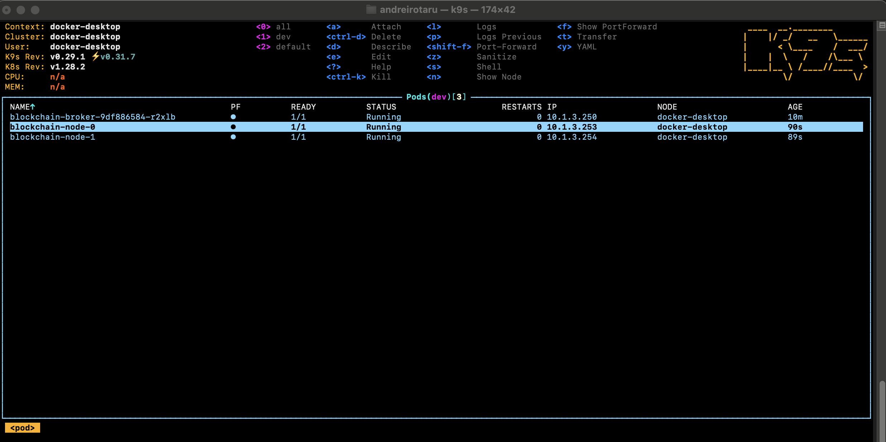
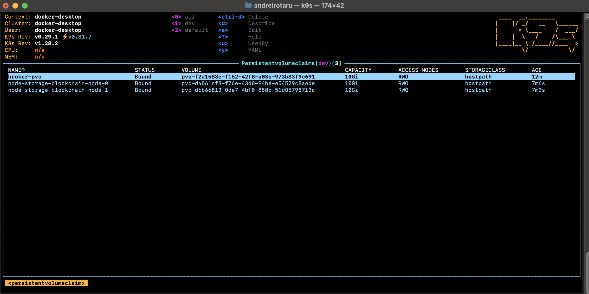
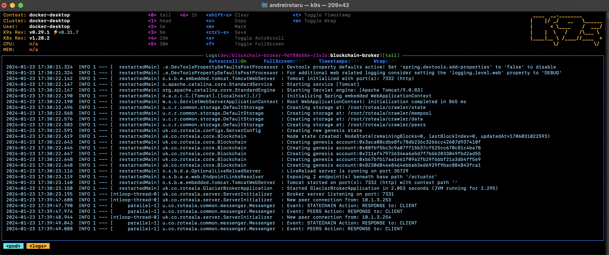
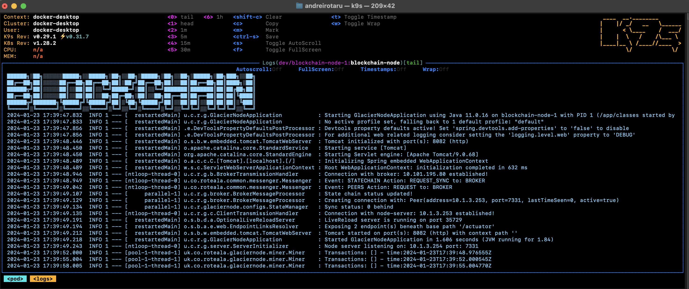
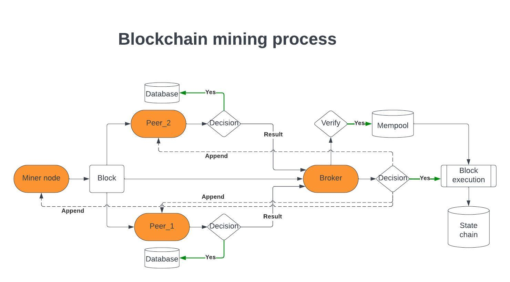

# Blockchain Project


**- Building the future one block at a time**

## Table of Contents

- [Project Overview](#project-overview)
- [Features](#features)
- [Getting Started](#getting-started)
- [Installation](#installation)
- [Author](#author)

## Project Overview

This is an early-stage blockchain project with a hierarchical administrative structure. In this project, brokers (governors) play a key role by allowing nodes to connect to them and act as peers for discovery. The Broker also provides API endpoints for wallets and explorer functionalities.

Here's how the project works:
- When a new transaction is initiated by a wallet, it is sent to a broker for initial verification (including signature, addresses, and amounts).
- After verification, the transaction is broadcasted to the nodes.
- Nodes will also verify the transaction and broadcast it, adding it to the mempool.
- When a new block is mined, it is broadcasted to the broker and other peers.
- Peers further validate the block, and when a consensus of 50%+1 (of all connected nodes) is reached, the broker sends an APPEND order.
- All nodes append the block, create transactions, and update balances.

## Features

- Written in Java 11
- Utilizes RocksDB for storage
- Fully reactive flow design
- Uses TCP connections
- Deployable in Kubernetes or on a local area network (LAN)



Persistent volume claims are used to store data.



Broker Preview:



Node Preview:



Mining Process Flowchart:



## Getting Started

To get started with this project, follow the installation instructions below.

## Installation
1. Download and install the commons:
   https://gitlab.com/java-blockchain/blockchain-commons
```shell
mvn clean install -DskipTests -U
```

2. Set up the persistent volume claim for the broker:
```shell
kubectl apply -f broker-pvc.yml
```

3. Build the image
```shell
skaffold build
```

4. Run as docker container or kubernetes:
```shell
docker run -p 7331:7331 -p 7332:7332 -d blockchain-broker:latest
```
```shell
kubectl apply -f broker-deployment.yml
```
For nodes, you only need to build the image and deploy it. There's no need to create persistent volume claims, as the StatefulSet will handle it. In Kubernetes, each image will bind to a specific pod ID.

## Author

- Rotaru "Roti" Andrei(rotaru.andrei98@gmail.com)


